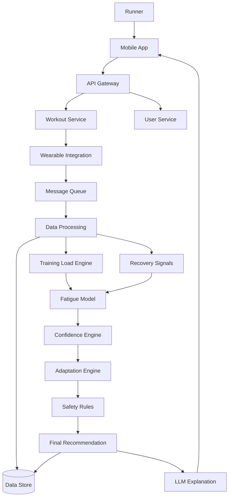

# StrideAI Architecture

## High-level architecture

## Key components

### Wearable integration
Normalizes provider-specific APIs into a common StrideAI schema.

### Message queue
Decouples ingestion from processing and absorbs bursts.

### Data processing
Validates data, detects duplicates, records provenance, and handles incomplete inputs.

### Training-load and recovery engines
Transform raw data into structured coaching signals.

### Fatigue model
Produces a state such as Normal, Elevated, Extreme, or Unknown plus confidence information.

### Confidence engine
Controls AI autonomy:
- High confidence → automatic adjustment
- Medium confidence → recommendation + confirmation
- Low confidence → no automatic change

### Adaptation engine
Converts model outputs into workout changes such as intensity, pace, distance, duration, or workout type.

### Safety rules
Deterministic constraints that cannot be overridden by generative behavior.

### LLM explanation
Generates human-readable explanations from structured decision factors. It should not independently invent safety-critical workout changes.

## Failure handling

| Failure | Expected behavior |
|---|---|
| Wearable API unavailable | Do not adapt using missing critical data |
| Invalid workout data | Reject/flag data |
| Duplicate workout | Deduplicate |
| Queue backlog | Scale workers |
| Model unavailable | Safe fallback |
| Low confidence | No automatic change |
| Explanation service unavailable | Predefined explanation fallback |
| Critical safety violation | Pause/rollback affected behavior |

## Scalability

- Kubernetes/autoscaling for compute
- Message queue for burst absorption
- Model routing for cost control
- Caching for reusable environmental information
- Tiered storage for recent vs. historical data

## Observability

Monitor:
- API latency/errors
- Queue depth
- Processing failures
- Sync success
- Recommendation latency
- Model quality
- Confidence distribution
- Infrastructure utilization
- Cost per active runner

## Security & Data Governance

StrideAI processes wearable and recovery-related user data, so privacy and data governance are treated as architecture requirements rather than post-launch considerations.
Key controls:
* Encrypt sensitive data in transit and at rest.
* Use least-privilege access controls between services.
* Store wearable provider OAuth credentials/tokens separately from coaching data.
* Record and audit access to sensitive user data.
* Minimize retained data to what is required for coaching, evaluation, and agreed product analytics.
* Apply explicit retention and deletion policies for user and wearable data.
* Avoid sending unnecessary raw personal data to the LLM; provide only the structured decision factors required for explanation.
* Maintain data provenance so recommendations can be traced back to the input data and model/rules versions used.
