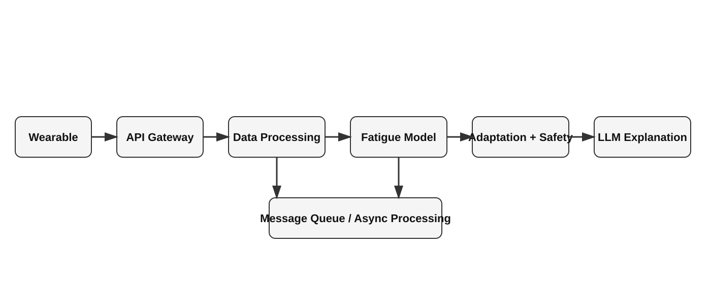
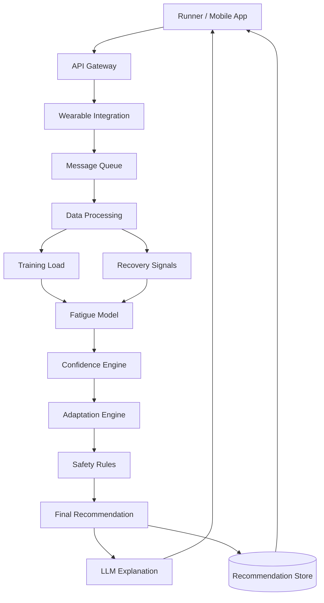
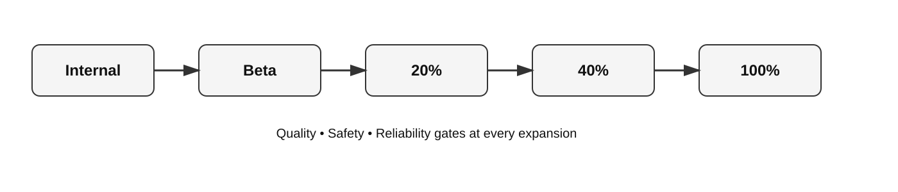

# StrideAI — AI Adaptive Coaching Technical Program Case Study

Viet Le | Technical Program Manager

How would I lead the launch of an AI system where recommendation quality, safety, and uncertainty directly affect user behavior?

StrideAI is a simulated AI running-coach program designed to demonstrate how I approach complex technical programs across Product, Engineering, Data Science, QA, and Platform.

What this case study demonstrates:

- Product → technical requirements
- Architecture → executable program
- AI evaluation → launch gates
- Risk → mitigation → executive decision
- Controlled rollout → evidence-based scaling

---

## Executive summary

StrideAI is an adaptive AI running coach for recreational runners from 5K through marathon.

The product's core differentiation is **continuous training adaptation** using:

- Performance data
- Recovery signals
- Wearable data
- Training load
- Real-world conditions such as weather

The central program challenge is balancing **AI recommendation quality, safety, technical complexity, launch timing, and engineering capacity**.

### My program recommendation

Protect the commercial launch through **controlled exposure** while protecting the quality bar through explicit evidence-based gates:

**Internal → Beta → 20% → 40% → 100%**

---

## What this case study demonstrates

| Area | Demonstrated capability |
|---|---|
| Product strategy | MVP prioritization and differentiation |
| Technical program management | Roadmap, critical path, dependencies |
| Architecture | AI system design and technical trade-offs |
| AI governance | Model evaluation and quality gates |
| Risk management | RAID, mitigation and escalation |
| Executive communication | Concise status and decision recommendations |
| Launch management | Controlled rollout and rollback |

---

## Product strategy

### Target users

Recreational runners ranging from 5K to marathon.

### Product positioning

> **The smartest adaptive running coach for everyday runners.**

### MVP priorities

1. Wearable synchronization
2. Training-load assessment
3. Recovery/fatigue assessment
4. Confidence-based adaptation
5. Safety rules
6. Recommendation explanation

Secondary features such as race prediction, weekly summaries and advanced progress tracking are deferred to protect the core differentiator.

---

## Technical architecture

### Key architecture decision

**ML/deterministic logic makes the core coaching decision; the LLM explains it.**

The reasoning is that safety-critical adaptation needs to be predictable, testable, observable and auditable. The LLM adds value through natural-language explanation without independently inventing safety-critical behavior.

---

## Program execution

### Six-week MVP plan

| Week | Primary focus |
|---|---|
| 1 | Architecture, API integration, schemas |
| 2 | Data ingestion and first end-to-end slice |
| 3 | Training load, recovery and fatigue model |
| 4 | Adaptation, safety and explanation |
| 5 | Integration, performance and monitoring |
| 6 | Internal beta and controlled rollout |

### Critical path

**Wearable integration → validated data → fatigue model → confidence → safety → adaptation → mobile → launch**

A key milestone is the end of Week 2:

> One real workout should flow through the system end-to-end and produce a basic recommendation.

---

## Major program risk

At the Week 3 checkpoint, assume recommendation quality is **74%** against an **80% production target**.

At the same time, delaying the announced launch could jeopardize a major commercial partnership.

Rather than choosing between an unconditional launch and a full schedule delay, the recommended strategy is:

**Internal → Beta → 20% → 40% → 100%**

Each expansion requires explicit quality, safety and reliability gates.

---

## Controlled rollout

Scenario assumption: Internal → Beta → 20% → 40% → 100%. Each stage requires explicit quality, safety and reliability gates before expanding exposure, with predefined rollback criteria.

## AI evaluation framework

"AI accuracy" is not treated as one universal metric.

Quality is evaluated across four layers:

### 1. Model quality
- Precision
- Recall
- F1
- Calibration
- False-positive / false-negative rates

### 2. Recommendation quality
- Expert evaluation
- Historical backtesting
- Decision-quality analysis

### 3. Safety
- Critical safety violation rate
- Safety test coverage
- Low-confidence automatic adaptation

### 4. User outcomes
- Recommendation acceptance
- Override rate
- Satisfaction
- Retention
- Training adherence

A critical safety violation is treated as a separate, much stricter gate than general recommendation quality.

---

## Program governance

The case study includes:

- Jira-style MVP backlog
- RAID log
- Dependency management
- Architecture Decision Records
- AI quality gates
- Rollout / rollback criteria
- Executive weekly status

---

## Portfolio artifacts

### Product
- [Product strategy](01-product/product-strategy.md)

### Architecture
- [Architecture](02-architecture/architecture.md)
- [ADR — Async processing](02-architecture/adr/ADR-001-async-processing.md)
- [ADR — Deterministic safety rules](02-architecture/adr/ADR-002-safety-rules.md)
- [ADR — Confidence-based AI autonomy](02-architecture/adr/ADR-003-confidence-engine.md)
- [ADR — Wearable abstraction](02-architecture/adr/ADR-004-wearable-abstraction.md)
- [ADR — LLM explanation](02-architecture/adr/ADR-005-llm-explanation.md)

### Program management
- [Jira-style backlog](03-program-management/jira-backlog.md)
- [RAID log](03-program-management/raid-log.md)

### AI
- [AI evaluation framework](04-ai-evaluation/evaluation-framework.md)

### Executive communication
- [Executive weekly status](05-executive/executive-status.md)
- [Executive presentation](presentation/StrideAI-Executive-Portfolio-Deck.pptx)

---

## Disclaimer

StrideAI is a simulated case study and is not a production product or prior employment project.
