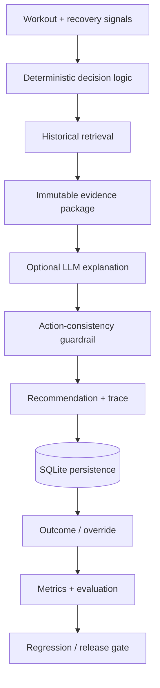

# StrideAI — AI Coaching Deployment and Technical Program Portfolio

Viet Le | Technical Program / AI Deployment Portfolio

StrideAI began as a TPM case study for launching an adaptive running coach. It has since evolved into a working portfolio implementation covering deterministic decision logic, guarded LLM explanations, real activity ingestion, persistence, observability, outcome feedback, release gates, and real-world validation.

The project is designed to answer a practical deployment question:

> How do you build, deploy, evaluate, and improve an AI-assisted workflow when recommendation quality, uncertainty, safety, and user behavior all matter?

## What the project demonstrates

| Area | Evidence in the repository |
|---|---|
| Product strategy | MVP definition, trade-offs, rollout design |
| Technical program management | backlog, RAID, dependencies, milestones |
| Architecture | deterministic decision layer, retrieval, guarded LLM explanation |
| AI deployment | FastAPI service, persistence, Docker, CI |
| AI evaluation | safety tests, groundedness checks, regression gates |
| Real data | Garmin/Strava-compatible ingestion and sanitized real validation |
| Human-in-the-loop | confidence, human review, override/outcome capture |
| Production learning | adoption metrics, failure analysis, accumulated-fatigue iteration |

---

## Core architecture principle

**Deterministic logic makes the coaching decision; the LLM explains it.**

Safety-critical behavior remains predictable, testable and auditable. The LLM receives an evidence package containing the already-approved action and cannot replace the structured recommendation. Invalid or inconsistent model output falls back to a deterministic explanation.

---

## Evolution from case study to working system

### v1 — program and architecture design

The original portfolio established:

- product strategy and MVP scope,
- system architecture and ADRs,
- six-week delivery plan,
- Jira-style backlog and RAID log,
- AI evaluation framework,
- controlled rollout and rollback approach,
- executive status communication.

### v2 Milestone 1 — deterministic API

- FastAPI recommendation endpoint
- structured input/output models
- fatigue/risk rules
- safety overrides
- confidence-based autonomy
- automated tests

### v2 Milestone 2 — guarded AI explanation

- historical-context retrieval
- immutable evidence package
- optional OpenAI Responses API explanation
- deterministic fallback
- action-consistency guardrail
- latency/token/fallback tracing

### v2 Milestone 3 — real data and persistence

- Garmin/Strava TCX ingestion
- Garmin activity-summary CSV ingestion
- SQLite storage for activities, recommendations and outcomes
- Docker packaging
- GitHub Actions CI

### v2 Milestone 4 — deployment quality loop

- recommendation acceptance and override metrics
- outcome coverage and completion metrics
- explanation groundedness checks
- unsupported numeric-claim detection
- persisted outcome retrieval
- regression/release gates
- lightweight operational dashboard

### v2 Milestone 5 — accumulated recovery debt

Real retrospective validation exposed a more interesting problem than simple threshold tuning: the system needed to distinguish one poor recovery day from a sustained deterioration pattern.

Milestone 5 adds:

- 3-day and 7-day observed recovery windows,
- repeated short-sleep detection,
- HRV position against the wearable's actual baseline range,
- HRV trend and resting-HR rise,
- subjective fatigue and event proximity,
- accumulated-fatigue states,
- sanitized real validation,
- separate contemporaneous-vs-hindsight evaluation labels,
- outcome-aligned warning measurement.

A single bad night can create a warning without forcing a training change. Repeated poor recovery can escalate the recommendation. Pain and severe soreness remain hard safety overrides.

See the working implementation in [`07-v2-implementation`](07-v2-implementation/README.md).

---

## Real-validation learning

The first real validation sequence initially appeared to show that StrideAI was too conservative because the athlete repeatedly chose to maintain training.

A later below-expectation target event changed the interpretation. The athlete judged the earlier recovery warnings as directionally useful in hindsight, suggesting that **exact agreement with the athlete's morning decision is not enough to evaluate an AI coach**.

The project therefore keeps three concepts separate:

1. the athlete's decision at the time,
2. StrideAI's recommendation,
3. the later outcome-informed assessment.

This does not prove causality or coaching efficacy. It demonstrates how production evidence can change a product hypothesis without rewriting the original labels.

The public validation fixture is sanitized and transformed; raw wearable history and exact personal biometrics are not committed.

---

## Repository structure

### Product
- [Product strategy](01-product/product-strategy.md)

### Architecture
- [Architecture](02-architecture/architecture.md)
- [ADR — Async processing](02-architecture/adr/ADR-001-async-processing.md)
- [ADR — Deterministic safety rules](02-architecture/adr/ADR-002-safety-rules.md)
- [ADR — Confidence-based AI autonomy](02-architecture/adr/ADR-003-confidence-engine.md)
- [ADR — Wearable abstraction](02-architecture/adr/ADR-004-wearable-abstraction.md)
- [ADR — LLM explanation](02-architecture/adr/ADR-005-llm-explanation.md)

### Program management
- [Jira-style backlog](03-program-management/jira-backlog.md)
- [RAID log](03-program-management/raid-log.md)

### AI evaluation
- [Evaluation framework](04-ai-evaluation/evaluation-framework.md)

### Executive communication
- [Executive weekly status](05-executive/executive-status.md)
- [Executive presentation](presentation/StrideAI-Executive-Portfolio-Deck.pptx)

### Working implementation
- [StrideAI v2 implementation](07-v2-implementation/README.md)
- [Milestone 5 real-validation design](07-v2-implementation/MILESTONE-5-REAL-VALIDATION.md)

---

## Current validation boundary

StrideAI is a portfolio project, not a production coaching or medical system. The current rules and accumulated-fatigue thresholds are heuristics. The real-validation sample is small and retrospective.

The next evidence step is prospective validation: record recovery signals and the athlete's independent decision first, reveal the StrideAI recommendation second, and then capture the actual workout and subsequent outcome without changing the original labels.
